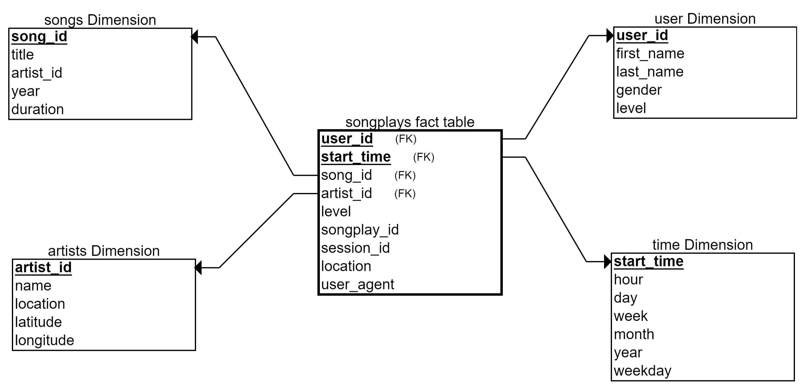

# Project: Data Pipelines with Apache Airflow

## Introduction

<p>A music streaming company, Sparkify, decided that to introduce more automation and monitoring to their data warehouse ETL pipelines and come to the conclusion that the best tool to achieve this is Apache Airflow.</p>

<p>The goal is to create high grade data pipelines that are dynamic and built from reusable tasks, can be monitored, and allow easy backfills. Tests need to run against their datasets after the ETL steps have been executed to catch any discrepancies in the datasets.</p>

<p>The source data resides in S3 and needs to be processed in Sparkify's data warehouse in Amazon Redshift. The source datasets consist of JSON logs that tell about user activity in the application and JSON metadata about the songs the users listen to.</p>

## How the pipeline looks:


## Datasets

For this project, there are two datasets. Here are the s3 links for each:

>**s3://udacity-dend/song_data/**<br>
>**s3://udacity-dend/log_data/**

## Data Modeling with Star Schema



## Configuring the DAG

In the DAG, add default parameters according to these guidelines

1. The DAG does not have dependencies on past runs
2. Run hourly
3. Retries happen every 5 minutes
4. Catchup is turned off


**Configure the task dependencies**
```
start_operator  \
    >> create_trips_table \
    >> [stage_events_to_redshift, stage_songs_to_redshift] \
    >> load_songplays_table \
    >> [ load_songs_table, load_artists_table, load_time_table, load_users_table] \
    >> run_quality_checks \
    >> end_operator
```

## Project Files

>- The **spakify_dag.py** includes all the imports, tasks and task dependencies <br>
>- The **operators** folder includes 4 user defined operators  that will stage the data, transform the data, fill the data warehouse, and run checks on data quality. <br>
>- A **helper** class for the SQL transformations

## How to run

1. Add your AWS creedentials
2. Run the python script `python create_tables.py`
3. Execute the Dag within Airflow. 

Below is shown how to add the AWS Redshift and AWS IAM user credentials to the Airflow instance, so that the DAG can execute successfully. 


## Add Airflow Connections to AWS

Use Airflow's UI to configure your AWS credentials and connection to Redshift.

1. Click on the Admin tab and select Connections.


2. Under Connections, select Create. <br>


3. On the create connection page, enter the following values:

>- **Conn Id**: Enter aws_credentials.
>- **Conn Type**: Enter Amazon Web Services.
>- **Login**: Enter your Access key ID from the IAM User credentials you downloaded earlier.
>- **Password**: Enter your Secret access key from the IAM User credentials you downloaded earlier.
Once you've entered these values, select Save and Add Another.


4. On the next create connection page, enter the following values:

>- **Conn Id**: Enter redshift.
>- **Conn Type**: Enter Postgres.
>- **Host**: Enter the endpoint of your Redshift cluster, excluding the port at the end. You can find this by selecting your cluster in the Clusters page of the Amazon Redshift console. See where this is located in the screenshot below. IMPORTANT: Make sure to NOT include the port at the end of the Redshift endpoint string.
>- **Schema**: Enter dev. This is the Redshift database you want to connect to.
>- **Login**: Enter awsuser.
>- **Password**: Enter the password you created when launching your Redshift cluster.
>- **Port**: Enter **5439**. <br>


Finally hit **Save**.
# Automate_data_pipelines_with_Airflow
